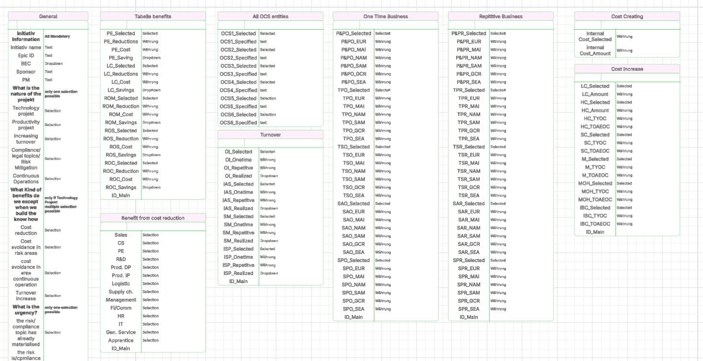
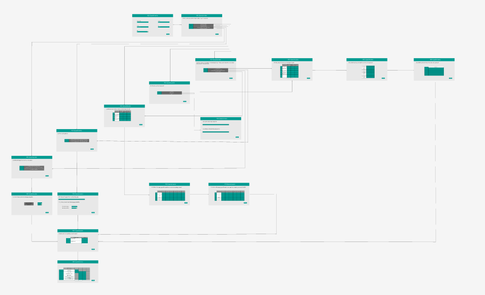

# Powerapps Projekt Doku

## Ziel und Rahmen

Ziel: Umsetzung einer Power Apps Canvas App mit einfacher Benutzeroberfläche, basierend auf bestehenden Excel-Daten.

Vorgabe: Nutzung von Power Apps, Integration aller Werte aus der Excel-Datei, einfache UI.

Architektur: SharePoint-Listen als Datenbankstruktur.

## Listen

Ich habe mich entschieden, als Datenbankstruktur einfache SharePoint-Listen zu verwenden und diese entsprechend aufzuteilen. Zur Orientierung habe ich das zunächst in Lucidchart modelliert, wie im untenstehenden Bild zu sehen ist.

Datentyp-Entscheidungen:
Person-Felder vs. Text (z. B. Unummer = User().Email als Text).
Choice-Felder: JA/NEIN als Choice oder Boolean? Aktuell via Kontextvariable gelöst.



## Namenskonvention

Ich habe diese Namenskonvention gewählt, um zu kennzeichnen, welche Frage auf diesem Bildschirm angezeigt wird und auf welcher Seite sie sich befindet.

‘00/1’

‘1/2’

‘1.1/3’

‘1.5/4’

‘2.2/5’

‘1.3/6’

‘1.4/7’

Weitere: …

## Figma

Ich konnte anschließend mit der Modellierung der einzelnen Seiten in Figma beginnen. Dabei habe ich darauf geachtet, dass die jeweiligen Verbindungen sichtbar sind und die Seiten so aussehen, wie ich sie später in Powerapps umsetzen möchte. Einige Elemente sind erst während der Umsetzung in Powerapps hinzugekommen.


## Powerapps

Nachdem die ersten Power-Apps-Seiten angelegt waren, habe ich mit der Startfolie begonnen. Nach Rücksprache mit dem Auftraggeber habe ich zunächst alle Folien designt und in der geplanten Reihenfolge angeordnet. Anschließend habe ich einen Button erstellt, der zur nächsten Folie navigiert. Der Code dafür lautet:

**Navigation:**

```txet

Navigate('1'; ScreenTransition.None)
```

Beim Drücken des Buttons gelangt man so zur gewünschten Folie.

Danach habe ich die Navigation basierend auf einer Auswahl implementiert. Anfangs hatte ich etwas Mühe, die Logik so aufzubauen, dass je nach Auswahl eine bestimmte Seite geöffnet wird. Hier kommt eine If-/Switch-Funktion zum Einsatz:

**Navigation bei Auswahl:**

```text

If(
    IsBlank(selectedone);
    Notify("Bitte zuerst eine Auswahl treffen."; NotificationType.Warning);
    Switch(
        selectedone;
        1; Navigate('1.1/3');
        2; Navigate('1.5/4');
        3; Navigate('2.2/5');
        4; Navigate('1.3/6');
        5; Navigate('1.4/7')
    )
)
```

Zudem habe ich festgelegt, dass man an bestimmten Stellen nur JA/NEIN auswählen kann (nicht überall, sondern gezielt). Die Seite ist dabei wie folgt aufgebaut:

**OnVisible:**

```text

UpdateContext({ selectedone: Blank() })
```

**Beim Klick auf das JA/NEIN-Feld (OnCheck):**

```text

UpdateContext({ selectedone: 1 })
```

**Default:**

```text

selectedone = 1
```

Gegen Ende habe ich mit der Implementierung der Datenbank-Verbindungen begonnen. Das kann je nach Formular unterschiedlich aussehen. Hier ein Beispiel:

```text

Set(Person; User());;
Set(Eintrag; Patch(
    tbl_General;
    Defaults(tbl_General);
    {
        Initiativ_name: DataCardValue21.Text;
        Epic_ID: DataCardValue13.Text;
        Sponsor: DataCardValue14.Text;
        PM: DataCardValue15.Text;
        BEC: DataCardValue16.Selected;
        Unummer: Person.Email
    }
));;
```

Zusätzlich habe ich einfache Berechnungen eingebaut, beispielsweise:

```text

Coalesce(Value(DataCardValue4.Text); 0) + Coalesce(Value(DataCardValue47.Text); 0)
```

Ich habe auf dem Bühler-Button eine Home-Funktion eingebaut, falls man von vorne beginnen möchte.

Auf dem Info-Button ist derzeit nur ein Beispieltext hinterlegt; dieser wird noch geändert.
